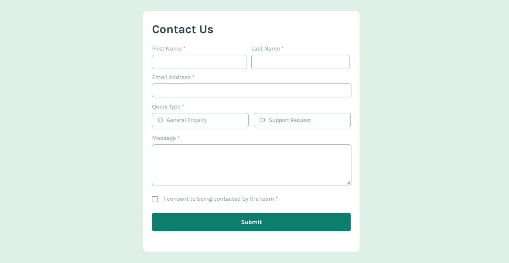

# Frontend Mentor - Contact form solution

This is a solution to the [Contact form challenge on Frontend Mentor](https://www.frontendmentor.io/challenges/contact-form--G-hYlqKJj). Frontend Mentor challenges help you improve your coding skills by building realistic projects. 

## Table of contents

- [Overview](#overview)
  - [The challenge](#the-challenge)
  - [Screenshot](#screenshot)
  - [Links](#links)
- [My process](#my-process)
  - [Built with](#built-with)
  - [What I learned](#what-i-learned)
  - [Continued development](#continued-development)
  - [Author](#author)
 


## Overview

### The challenge

Users should be able to:

- Complete the form and see a success toast message upon successful submission
- Receive form validation messages if:
  - A required field has been missed
  - The email address is not formatted correctly
- Complete the form only using their keyboard
- Have inputs, error messages, and the success message announced on their screen reader
- View the optimal layout for the interface depending on their device's screen size
- See hover and focus states for all interactive elements on the page

### Screenshot




### Links

- Solution URL: [Solution URL](https://www.frontendmentor.io/solutions/contact-form---responsive-form-layout-made-using-html-css-and-js-pCJLId1Wmw)
- Live Site URL: [live site URL](https://unnati-chaudhari.github.io/Contact-form-main/)

## My process

### Built with

- Semantic HTML5 markup
- CSS
- Flexbox
- Responsive design
- CSS pseudo-classes
- JavaScript
- DOM manipulation
- JavaScript form validation
- Regular expressions
- Google Fonts
- Font Awesome icons

### What I learned

This project helped me improve my understanding of HTML forms, CSS layouts, responsive design, and JavaScript form validation.

#### Form validation with JavaScript

I learned how to prevent a form from submitting when there are validation errors:

```javascript
form.addEventListener("submit", (event) => {
    event.preventDefault();

    let isValid = true;

    // Validation logic

    if (isValid) {
        successMessage.style.display = "block";
        form.reset();
    }
});

```

## Continued development
 -Advanced JavaScript
 -More complex form validation
 -Accessibility and screen-reader support
 -CSS Grid and advanced Flexbox
 -Responsive web design
 -DOM manipulation
 -JavaScript events

## Author
GitHub: @Unnati-Chaudhari
Frontend Mentor: @Unnati-Chaudhari


